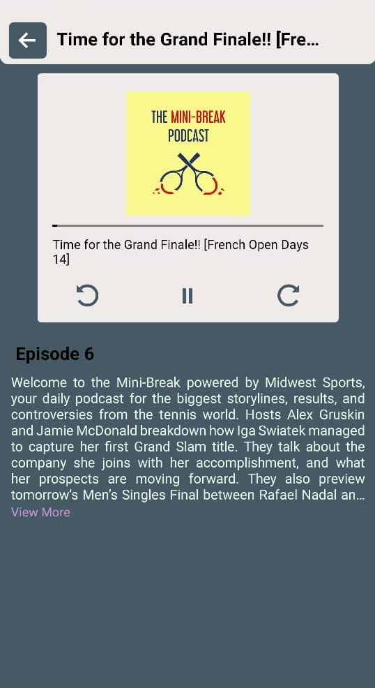
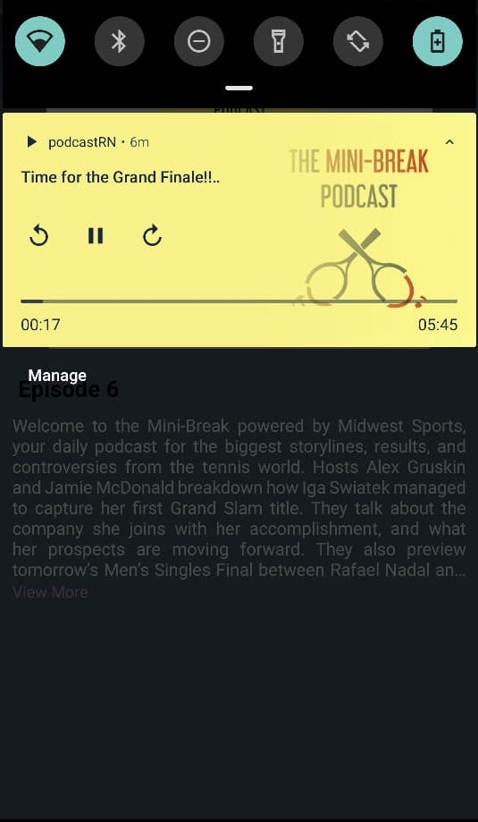
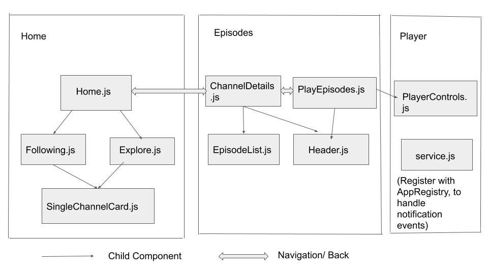

# podcast-assignment

Install the diawi apk from this link : 

## Features
• Parse one feed of your choosing and display episodes in a list.

• User can tap episode and navigate to a "play" interface.

• Play interface will show artwork, progress timeline, forward and reverse 30 seconds and a play / pause button.

• User should also have the ability to view episode notes.

• User can go back to the episode list from the play interface.
## Additional feature

• User can listen to the podcast even if the app is in background state.

• User can control currently playing podcast through notification bar. 

• User can follow channels/albums. 

## File Structure
components distribution

## Main third party library used

• "react-native-track-player",

• "react-native-vector-icons", 

• "react-redux",

• "react-navigation" 

   
   
 
   
   
   
   

